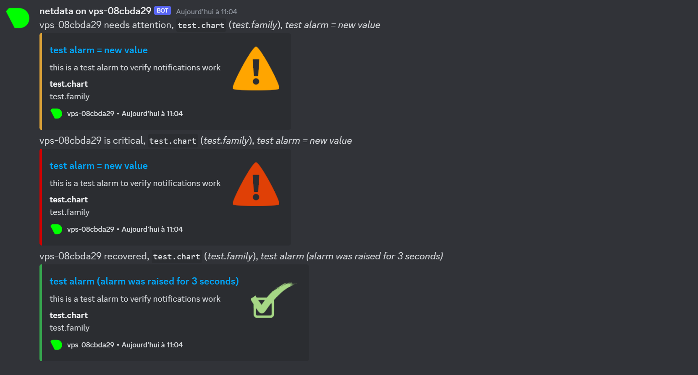
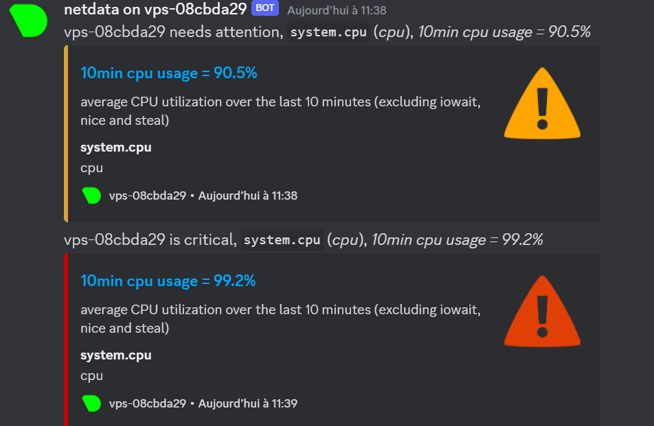

                           Rendu Projet Infrastucture et SI 


PREREQUIS :
Il faut 
- un serveur web
- un serveur pour le reverse proxy
- un nom de domaine


PARTIE SERVEUR WEB                           
Nom de machine :
```
martin@web:~$ sudo cat /etc/hostname
[sudo] password for martin:
web
```
```
martin@web:~$ sudo cat /etc/hosts
127.0.0.1       localhost

# The following lines are desirable for IPv6 capable hosts
::1     ip6-localhost   ip6-loopback
fe00::0 ip6-localnet
ff00::0 ip6-mcastprefix
ff02::1 ip6-allnodes
ff02::2 ip6-allrouters
ff02::3 ip6-allhosts


127.0.1.1       vps-9b9ef8b3.vps.ovh.net        web
127.0.1.1       vps-9b9ef8b3.vps.ovh.net        vps-9b9ef8b3

```

Accés en ssh avec le port changé : 

```
martin@web:~$ sudo cat /etc/ssh/sshd_config | grep Port
[sudo] password for martin:
Port 4050
martin@web:/etc/ssh$ sudo ufw allow 4050/tcp
martin@web:/etc/ssh$ sudo ss -tlnp | grep 4050
LISTEN 0      128          0.0.0.0:4050      0.0.0.0:*    users:(("sshd",pid=9317,fd=3))


LISTEN 0      128             [::]:4050         [::]:*    users:(("sshd",pid=9317,fd=4))
```
```
ssh martin@51.75.200.78 -p 4050
```

Update de la machine et installation de git
```
martin@web:/$ sudo apt-get update
martin@web:/$ sudo apt-get install git

```
Clone du github contenant le jeu A Dark Room
```
martin@web:/$ git clone https://github.com/doublespeakgames/adarkroom.git

```
Installation de différents paquets pour faire fonctionner le jeu corretcement 
```
martin@web:/$ sudo apt-get install apache2 php libapache2-mod-php

```
On déplace le répo à un endroit appproprié
```
martin@web:/$ sudo cp -r adarkroom/* /var/www/html/

```
On modifie le fichier de configuration Apache pour ajouter un nouveau site virtuel qui pointe vers le dossier adarkroom
```
martin@web:/$ sudo nano /etc/apache2/sites-available/adarkroom.conf

```
```
<VirtualHost *:80>
    ServerName lesmodos2.xyz
    DocumentRoot /var/www/html/
    <Directory /var/www/html/>
        Options Indexes FollowSymLinks
        AllowOverride All
        Require all granted
    </Directory>
</VirtualHost>

```
On reload, active et restart la conf pour prendre en compte les modifications 
```
martin@web:/$ sudo systemctl reload apache2
martin@web:/$ sudo a2ensite adarkroom.conf
martin@web:/$      
```

Le jeu est maintenant accesible en ligne depuis http://51.75.200.78/


```
martin@web:/etc$ sudo apt-get install fail2ban
```

```
martin@web:/etc$ sudo cat /etc/fail2ban/jail.conf
```

```
martin@web:/etc$ sudo systemctl restart fail2ban
```
```
martin@web:/etc$ sudo fail2ban-client status sshd
Status for the jail: sshd
|- Filter
|  |- Currently failed: 1
|  |- Total failed:     16
|  `- File list:        /var/log/auth.log
`- Actions
   |- Currently banned: 1
   |- Total banned:     1
   `- Banned IP list:   54.169.166.141
```

```
martin@web:/etc$ sudo fail2ban-client set sshd unbanip 54.169.166.141
1
```


Bloqué l'adresse ip du serveur web et pouvoir paser uniquement par le reverse proxy

```
martin@web:/var/log/apache2$ sudo iptables -A INPUT -p tcp -s 51.75.203.219 --dport 80 -j ACCEPT
martin@web:/var/log/apache2$ sudo iptables -A INPUT -p tcp -s 51.75.203.219 --dport 443 -j ACCEPT
martin@web:/var/log/apache2$ sudo iptables -A INPUT -p tcp --dport 80 -j DROP
martin@web:/var/log/apache2$ sudo iptables -A INPUT -p tcp --dport 443 -j DROP
```


Fail2ban sur le serveur web

```
martin@web:~$ sudo nano /etc/fail2ban/jail.d/lesmodos2.conf
[lesmodos2]
enabled = true
port = http,https
filter = lesmodos2
logpath = /var/log/apache2/access.log
maxretry = 4
```

```
martin@web:~$ sudo cat /etc/fail2ban/filter.d/lesmodos2.conf
[Definition]
failregex = ^<HOST>.*"(GET|POST).*HTTP.*" 4\d{2}.*
ignoreregex =
```

```
martin@web:~$ sudo systemctl restart fail2ban
```
```
martin@web:~$ sudo fail2ban-client set lesmodos2 unbanip 51.75.203.219
0
```
Netdata sur serveur web :
```
martin@web:/tmp$ wget -O /tmp/netdata-kickstart.sh https://my-netdata.io/kickstart.sh && sh /tmp/netdata-kickstart.sh
```

```
martin@web:/tmp$ bash ./netdata-kickstart.sh
```
```
martin@web:/tmp$ sudo su -
```
```
root@web:/etc/netdata# ./edit-config health_alarm_notify.conf

SEND_DISCORD="YES"

# Create a webhook by following the official documentation -
# https://support.discord.com/hc/en-us/articles/228383668-Intro-to-Webhooks
DISCORD_WEBHOOK_URL="https://discord.com/api/webhooks/1103680774781284464/CRQZdEnlw2NGPXkWcz8h3kSUOZTCji3K3dSNcraWtDyCr7Cs0pAwb842z6YhPDfuXJHx"
# if a role's recipients are not configured, a notification will be send to
# this discord channel (empty = do not send a notification for unconfigured
# roles):
DEFAULT_RECIPIENT_DISCORD="alerts"
```
```
root@web:/usr/libexec/netdata/plugins.d# ./alarm-notify.sh test

# SENDING TEST WARNING ALARM TO ROLE: sysadmin
2023-05-04 13:56:05: alarm-notify.sh: INFO: sent discord notification for: web test.chart.test_alarm is WARNING to 'alerts'
# OK

# SENDING TEST CRITICAL ALARM TO ROLE: sysadmin
2023-05-04 13:56:06: alarm-notify.sh: INFO: sent discord notification for: web test.chart.test_alarm is CRITICAL to 'alerts'
# OK

# SENDING TEST CLEAR ALARM TO ROLE: sysadmin
2023-05-04 13:56:06: alarm-notify.sh: INFO: sent discord notification for: web test.chart.test_alarm is CLEAR to 'alerts'
# OK
```

MAJ de la conf
```
root@web:/etc/netdata# netdatacli dumpconfig > /etc/netdata/netdata.conf
```
Ajout hostname
```
root@web:/etc/netdata# ./edit-config netdata.conf

 hostname = netdataweb.lesmodos2.xyz
```


PARTIE REVERSE PROXY


Nom de machine 
```
martin@reverse-proxy:~$ sudo cat /etc/hostname
[sudo] password for martin:
reverse-proxy
```
```
martin@reverse-proxy:~$ sudo cat /etc/hosts
127.0.0.1       localhost

# The following lines are desirable for IPv6 capable hosts
::1     ip6-localhost   ip6-loopback
fe00::0 ip6-localnet
ff00::0 ip6-mcastprefix
ff02::1 ip6-allnodes
ff02::2 ip6-allrouters
ff02::3 ip6-allhosts


127.0.1.1       vps-08cbda29.vps.ovh.net        reverse-proxy
127.0.1.1       vps-08cbda29.vps.ovh.net        vps-08cbda29
```

Connexion reverse proxy port changé
```
martin@reverse-proxy:~$ sudo cat /etc/ssh/sshd_config | grep Port
Port 4051
```

```
martin@reverse-proxy:~$ sudo ufw allow 4051/tcp
```
```
martin@web:~$ sudo ss -tlnp | grep 4050
LISTEN 0      128          0.0.0.0:4050      0.0.0.0:*    users:(("sshd",pid=9317,fd=3))


LISTEN 0      128             [::]:4050         [::]:*    users:(("sshd",pid=9317,fd=4))
```

```
ssh martin@51.75.203.219 -p 4051
```


mise en place du reverse_proxy: 
```
martin@reverse-proxy:~$ sudo apt-get update
```
```
martin@reverse-proxy:~$ sudo apt-get upgrade
```
```
martin@reverse-proxy:~$ sudo apt-get install apache2
```
```
martin@reverse-proxy:~$ sudo systemctl restart apache2
```
```
martin@reverse-proxy:~$ sudo a2enmod proxy
```
```
martin@reverse-proxy:~$ sudo systemctl restart apache2
```
```
martin@reverse-proxy:~$ sudo a2enmod proxy_http
```
```
martin@reverse-proxy:~$ sudo nano /etc/apache2/sites-available/000-default.conf
```
```
<VirtualHost *:80>
    ServerName example.com
    ServerAlias www.example.com
    DocumentRoot /var/www/html

    ErrorLog ${APACHE_LOG_DIR}/error.log
    CustomLog ${APACHE_LOG_DIR}/access.log combined

    <Directory /var/www/html>
        AllowOverride All
        Require all granted
    </Directory>

    # Reverse proxy configuration
    ProxyPass / http://51.75.200.78/
    ProxyPassReverse / http://51.75.200.78/
</VirtualHost>
```
```
martin@reverse-proxy:~$ sudo systemctl restart apache2
```


Protcole HTTPS
```
martin@reverse-proxy:~$ sudo add-apt-repository ppa:certbot/certbot

```
```
martin@reverse-proxy:~$ sudo apt-get update
```
```
martin@reverse-proxy:~$ sudo apt-get install certbot python3-certbot-apache

```
```
martin@reverse-proxy:~$ sudo nano /etc/apache2/sites-available/000-default.conf

```
```
  GNU nano 6.2                                                       /etc/apache2/sites-available/000-default.conf                                                                 <VirtualHost *:80>
    RewriteEngine On
    RewriteCond %{HTTPS} !=on
    RewriteRule ^/(.*) https://%{SERVER_NAME}/$1 [R,L]

    ServerName lesmodos2.xyz
    ServerAlias lesmodos2.xyz
    DocumentRoot /var/www/html

    Alias /.well-known/acme-challenge/ /var/www/html/.well-known/acme-challenge/

    ErrorLog ${APACHE_LOG_DIR}/error.log
    CustomLog ${APACHE_LOG_DIR}/access.log combined

    <Directory /var/www/html>
        AllowOverride All
        Require all granted
    </Directory>

    # Reverse proxy configuration
    ProxyPass / http://51.75.200.78/
    ProxyPassReverse / http://51.75.200.78/
RewriteCond %{SERVER_NAME} =lesmodos2.xyz
RewriteRule ^ https://%{SERVER_NAME}%{REQUEST_URI} [END,NE,R=permanent]
</VirtualHost>

```
```
martin@reverse-proxy:~$ sudo systemctl restart apache2
```
```
martin@reverse-proxy:/etc/apache2/sites-available$ sudo certbot --apache
Saving debug log to /var/log/letsencrypt/letsencrypt.log

Which names would you like to activate HTTPS for?
- - - - - - - - - - - - - - - - - - - - - - - - - - - - - - - - - - - - - - - -
1: lesmodos2.xyz
- - - - - - - - - - - - - - - - - - - - - - - - - - - - - - - - - - - - - - - -
Select the appropriate numbers separated by commas and/or spaces, or leave input
blank to select all options shown (Enter 'c' to cancel): 1
Requesting a certificate for lesmodos2.xyz

Successfully received certificate.
Certificate is saved at: /etc/letsencrypt/live/lesmodos2.xyz/fullchain.pem
Key is saved at:         /etc/letsencrypt/live/lesmodos2.xyz/privkey.pem
This certificate expires on 2023-07-15.
These files will be updated when the certificate renews.
Certbot has set up a scheduled task to automatically renew this certificate in the background.

Deploying certificate
Some rewrite rules copied from /etc/apache2/sites-enabled/000-default.conf were disabled in the vhost for your HTTPS site located at /etc/apache2/sites-available/000-default-le-ssl.conf because they have the potential to create redirection loops.
Successfully deployed certificate for lesmodos2.xyz to /etc/apache2/sites-available/000-default-le-ssl.conf
Added an HTTP->HTTPS rewrite in addition to other RewriteRules; you may wish to check for overall consistency.
Congratulations! You have successfully enabled HTTPS on https://lesmodos2.xyz

- - - - - - - - - - - - - - - - - - - - - - - - - - - - - - - - - - - - - - - -
If you like Certbot, please consider supporting our work by:
 * Donating to ISRG / Let's Encrypt:   https://letsencrypt.org/donate
 * Donating to EFF:                    https://eff.org/donate-le
```
https://lesmodos2.xyz


Envoie de mail pour savoir la disponibilités du site: 

```
martin@reverse-proxy:/srv$ sudo cat script.sh
#!/bin/bash

# Vérifier la disponibilité du site web
response=$(curl --write-out %{http_code} --silent --output /dev/null https://lesmodos2.xyz)
if [ "$response" -eq 200 ]; then
  echo "Le site https://lesmodos2.xyz est en ligne."
  echo "Le site web est en ligne." | mail -s "Site web accessible" orealyzgaming@gmail.com
else
  echo "Le site https://lesmodos2.xyz est hors ligne ! Envoi d'un e-mail d'alerte..."
  echo "Le site https://lesmodos2.xyz est hors ligne." | mail -s "Alerte : Le site https://lesmodos2.xyz est hors ligne" orealyzgaming@gmail.com
fi
```

```
martin@reverse-proxy:/srv$ sudo chmod +x script.sh
```
Recevoir une alerte toutes les 48h 
```
martin@reverse-proxy:~$ sudo cat /etc/systemd/system/script.service
[Unit]
Description=Site dispo

[Service]
ExecStart=/srv/script.sh
Restart=always
User=martin

[Timer]
OnBootSec=1min
OnUnitActiveSec=48h

[Install]
WantedBy=multi-user.target
```

```
martin@reverse-proxy:~$ sudo systemctl status script.service
● script.service - Site dispo
     Loaded: loaded (/etc/systemd/system/script.service; disabled; vendor preset: enabled)
     Active: active (running) since Sat 2023-05-06 12:03:33 UTC; 215ms ago
   Main PID: 20908 (script.sh)
      Tasks: 2 (limit: 2265)
     Memory: 2.4M
        CPU: 171ms
     CGroup: /system.slice/script.service
             ├─20908 /bin/bash /srv/script.sh
             └─20912 mail -s "Site web accessible" orealyzgaming@gmail.com

May 06 12:03:33 reverse-proxy systemd[1]: Started Site dispo.
May 06 12:03:34 reverse-proxy script.sh[20908]: Le site https://lesmodos2.xyz est en ligne.
```


Netdata sur le reverse proxy 

```
martin@reverse-proxy:/$ wget -O /tmp/netdata-kickstart.sh https://my-netdata.io/kickstart.sh && sh /tmp/netdata-kickstart.sh
```

```
martin@reverse-proxy:/tmp$ bash ./netdata-kickstart.sh
```

```
martin@reverse-proxy:/opt$ sudo su -
root@reverse-proxy:~# cd /opt/netdata/
```
```
root@reverse-proxy:/opt/netdata/etc/netdata# ./edit-config health_alarm_notify.conf
```

```
# discord (discord.com) global notification options

# multiple recipients can be given like this:
#                  "CHANNEL1 CHANNEL2 ..."

# enable/disable sending discord notifications
SEND_DISCORD="YES"

# Create a webhook by following the official documentation -
# https://support.discord.com/hc/en-us/articles/228383668-Intro-to-Webhooks
DISCORD_WEBHOOK_URL="https://discord.com/api/webhooks/1101407459463135293/_oNj9Iu95zoqBmDbajrzz7r9wf7g-rLYEVzlqIsTHZjFtJX9bMYgX58VmPPthZBzwGMY"
# if a role's recipients are not configured, a notification will be send to
# this discord channel (empty = do not send a notification for unconfigured
# roles):
DEFAULT_RECIPIENT_DISCORD="alerts"
```

```
root@reverse-proxy:/opt/netdata/usr/libexec/netdata/plugins.d# ./alarm-notify.sh test
```



```
martin@reverse-proxy:/opt$ sudo apt-get install stress
```

```
martin@reverse-proxy:/opt$ stress --cpu 2 --timeout 10m
stress: info: [30031] dispatching hogs: 2 cpu, 0 io, 0 vm, 0 hdd
stress: info: [30031] successful run completed in 600s
```




Creation des utilisateurs
-
```
PS C:\Users\titim> ssh ubuntu@51.75.203.219
connexion utilisateur de base 
```
```
alexandre@reverse-proxy:~$ sudo useradd alexandre -m -s /bin/bash -u 2000
crée un utilisateur avec un répertoire -m avec comme identifiant uid 2000 et definit bash en shell par défault 
```
```
alexandre@reverse-proxy:~$ usermod -aG admins alexandre
permet de mettre l'utilisateur alexandre admin
```

```
PS C:\Users\titim> ssh alexandre@51.75.203.219
connexion utilisateur alexandre
```

Creation key ssh
-
```
PS C:\Users\titim> ssh-keygen

Output
Generating public/private rsa key pair.
Enter file in which to save the key (/your_home/.ssh/id_rsa):

appuie sur entrer pour enregister dans ce dossier

Output
Enter passphrase (empty for no passphrase):

ecrire une phrase pour la connexion ou laisser vide


The key's randomart image is:

+---[RSA 3072]----+
|       ..+.      |
|        o..      |
|       ....      |
|      .oo+E      |
|    * +oSo.      |
|   o /.+.+ o     |
|  . *o@ +.+ .    |
|   oo++B =.o     |
|     ++.=..      |
+----[SHA256]-----+
```


```
PS C:\Users\titim> cat ~/.ssh/id_rsa.pub | ssh username@remote_host "mkdir -p ~/.ssh && touch ~/.ssh/authorized_keys && chmod -R go= ~/.ssh && cat >> ~/.ssh/authorized_keys"

aprés cela votre clée enregister dans id_rsa.pub sera copié à la fin du fichier authorized_keys du compte de l’utilisateur distant.

 désactiver la connexion par mot de passe :
 
 Dans le fichier /etc/ssh/sshd_config 
 modifier PasswordAuthentication yes 
 par PasswordAuthentication no
 ```